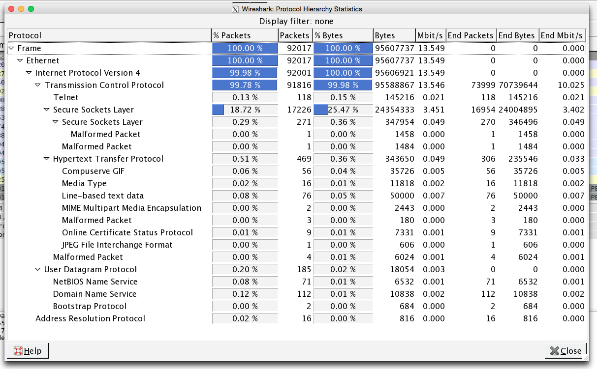
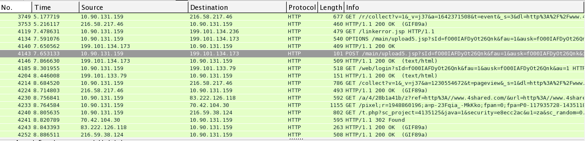

For Blackhat 2015, LogRhythm Labs had a forensics contest for analyzing a .pcap file and finding the secret missile launch code. Find the password and enter the contest to win one of these:


I really wanted to win this!

### Analyzing the PCAP with WireShark
I downloaded the .pcap file and loaded it into wireshark. I begun by checking the Protocol Hierarchy under Statistics to get a view on the protocols used.



Hmm...telnet? I selected telnet as filter then followed the TCP stream, It was a star wars "movie" in ascii art:)

Moving on from the Jedi mind tricks, I needed to find a secret missile launch code. I checked other TCP communications, a lot of encrypted data from google docs, I moved on to HTTP to see if I could find any interesting stuff there.

I immediately found a POST request to 4shared.com which is a file sharing site. This meant someone probably uploaded something, could it be the launch codes?



Upon further investigation, I found a file called 1b.txt that was uploaded containing what seems to be assembly code.

```
0    INP 14
1    LDA 14
2    LDB 15
3    CMP
4    JLT 11
```

I know nothing about assembly, the only thing I found that could help me was this: http://www.slidefinder.net/s/sec5_1assemblyprograms/sec521assemblyprograms/27400919

Looks like the same type of assembly I found. I probably spent more time on this than I should have.

Moving on in my investigation, I wanted to see if there were any more POST requests. Using this simple filter `http.request.method eq POST` I found two more POST requests to pastebin.com.

First request contained this string: `This is a test... hmmmmmm`

Second request contained the following:
```
0100101001101001010011100011010001001110010101000100110100110111010010100110100101001110001101000100111001101010010101010011011101001010011010010100111000110100010011100110101001001101001101110100101001101001010011100011010001001110011110100100100100110111010010100110100101001110001101000100111001101010010101010011011101001010011010010100111000110100010011100111101001010001001101110100101001101001010011100011010001001101011010100100000100110111010010100110100101001110001101000100111001000111010011010011011101001010011010010100111000110100010011100110101001000101001101110100101001101001010011100011010001001110011110100101010100110111010010100110100101001110001101000100111001101101010101010011011101001010011010010100111000110100010011100110101001001101001101110100101001101001010011100011010001001110011010100110011100110111010010100110100101001110001101000100110101101010010000010011011101001010011010010100111000110100010011100100010001001101001101110100101001101001010011100011010001001110011011010101100100110111010010100110100101001110001101000100111001101010010100010011011101001010011010010100111000110100010011100110101001010101001101110100101001101001010011100011010001001101001100100100010100110111010010100110100101001110001101000100110101101010010000010011011101001010011010010100111000110100010011010111101001001001001101110100101001101001010011100011010001001110011010100110001100110111010010100110100101001110001101000100110101111010010011010011011101001010011010010100111000110100010011010111101001100111001101110100101001101001010011100011010001001101011110100110101100110111010010100110100101001110001101000100111001101010010001010011011101001010011010010100111000110100010011010111101001001101001101110100101001101001010011100011010001001101011110100101000100110111010010100110100101001110001101000100110101101010010001010011011101001010011010010100111000110100010011010111101001000001001101110100101001101001010011100011010001001101011110100100100100110111010010100110100101001110001101000100110101111010011010110011011101001010011010010100111000110100010011010111101001100011001101110100101001101001010011100011010001001101011010100100110100110111
```

Binary code, perhaps this is what I am looking for.

If we convert this to ASCII we get:
```
JiN4NTM7JiN4NjU7JiN4NjM7JiN4NzI7JiN4NjU7JiN4NzQ7JiN4MjA7JiN4NGM7JiN4NjE7JiN4NzU7JiN4NmU7JiN4NjM7JiN4Njg7JiN4MjA7JiN4NDM7JiN4NmY7JiN4NjQ7JiN4NjU7JiN4M2E7JiN4MjA7JiN4MzI7JiN4Njc7JiN4MzM7JiN4Mzg7JiN4Mzk7JiN4NjE7JiN4MzM7JiN4MzQ7JiN4MjE7JiN4MzA7JiN4MzI7JiN4Mzk7JiN4Mzc7JiN4MjM7
```

What do we have here? At first I thought this was some kind of cipher but after spending to much time on this I realized that it actually could be base64. So by appending a `=` at the end and converting, we get the following:

<pre><code>&amp;#x53;&amp;#x65;&amp;#x63;&amp;#x72;&amp;#x65;&amp;#x74;&amp;#x20;&amp;#x4c;&amp;#x61;&amp;#x75;&amp;#x6e;&amp;#x63;&amp;#x68;&amp;#x20;&amp;#x43;&amp;#x6f;&amp;#x64;&amp;#x65;&amp;#x3a;&amp;#x20;&amp;#x32;&amp;#x67;&amp;#x33;&amp;#x38;&amp;#x39;&amp;#x61;&amp;#x33;&amp;#x34;&amp;#x21;&amp;#x30;&amp;#x32;&amp;#x39;&amp;#x37;&amp;#x23;</pre></code>

HTML entities, lets convert  this as well and see what we get:

`Secret Launch Code: 2g389a34!0297#`

Success!


